# Mapas de decisión por ruta

Cada diagrama describe **qué puede hacer el usuario** en esa ruta y hacia dónde suele ir después. Rutas del ecosistema Evernear alineadas con `src/app/` (octubre 2026).

**Leyenda común en verticales catálogo**

- Hero → guía de audiencia → catálogo con filtros (ciudad, categoría/tipo, vigencia).
- Las tarjetas del catálogo son **informativas** (sin enlace a detalle), salvo rutas dinámicas documentadas aparte.
- `VerticalNavStrip`: saltar a otra vertical sin volver al índice.

---

## Índice rápido

| Ruta | Sección |
|------|---------|
| `/` | [Home](#home-) |
| `/ecosistema` | [Índice ecosistema](#ecosistema) |
| `/que-es`, `/historias`, `/informacion` | [Comunidad / visión](#que-es-y-alias) |
| `/deporte` … `/innovacion` | [Verticales](#verticales-del-ecosistema) |
| `/comercios/panfleto`, `/comercios/[slug]` | [Comercios (extra)](#comercios-panfleto) |
| `/eventos/publicar`, `/eventos/[slug]` | [Eventos (extra)](#eventos-publicar) |
| `/educacion/[slug]` | [Educación detalle](#educacion-slug) |
| `/descubrimiento/personas/[id]`, `.../oportunidades/[id]` | [Descubrimiento detalle](#descubrimiento-detalle) |
| `/pulso` | [Pulso semanal](#pulso) |
| `/qr/escanear` | [QR](#qr-escanear) |
| `/terminos`, `/privacidad` | [Legal](#legal) |
| (global) | [Modal Unirse y mascota](#transversal-unirse-y-mascota) |

---

## Home `/`

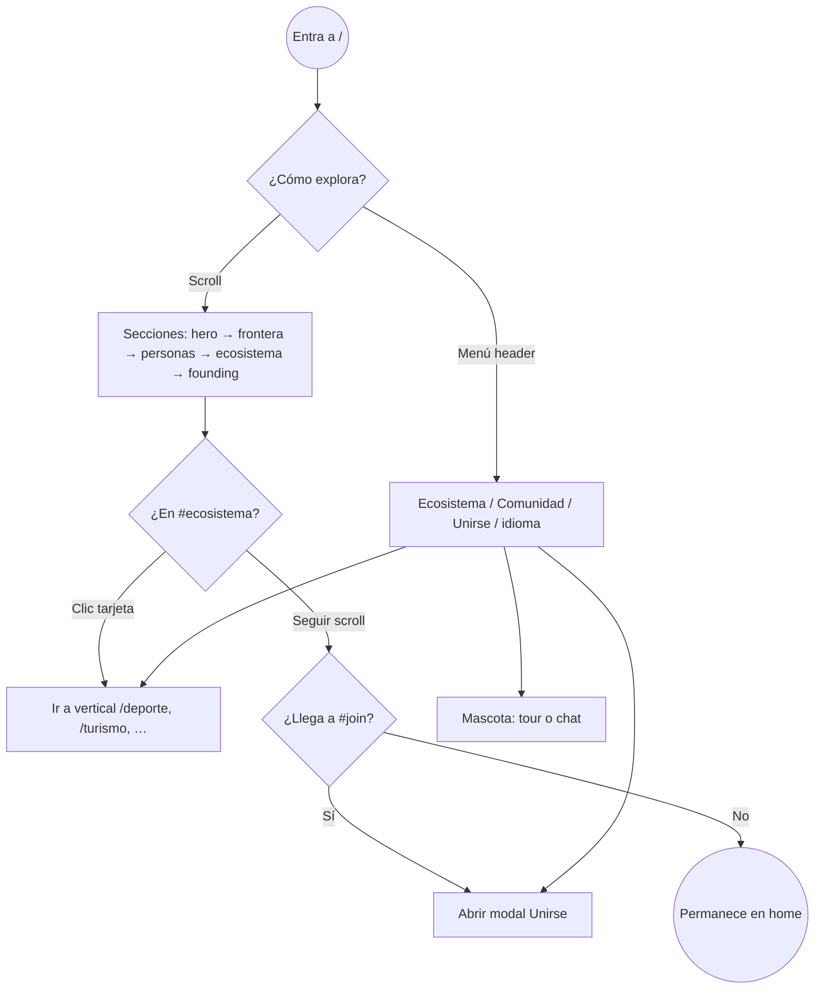
```mermaid
flowchart TD
  Start((Entra a /)) --> Nav{¿Cómo explora?}
  Nav -->|Scroll| Sec["Secciones: hero → frontera → personas → ecosistema → founding"]
  Nav -->|Menú header| Menu["Ecosistema / Comunidad / Unirse / idioma"]
  Sec --> EcoSec{¿En #ecosistema?}
  EcoSec -->|Clic tarjeta| Vert["Ir a vertical /deporte, /turismo, …"]
  EcoSec -->|Seguir scroll| JoinSec{¿Llega a #join?}
  JoinSec -->|Sí| Join["Abrir modal Unirse"]
  JoinSec -->|No| End((Permanece en home))
  Menu --> Vert
  Menu --> Join
  Menu --> Mascot["Mascota: tour o chat"]
```

---

## `/ecosistema`

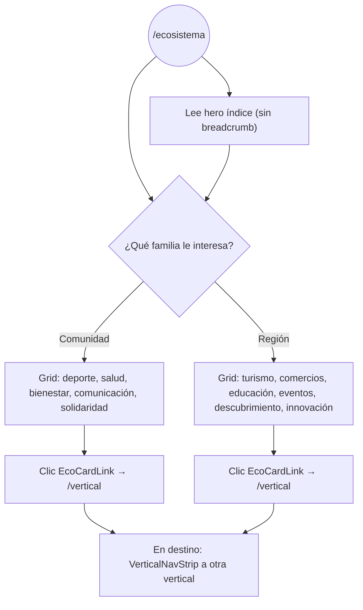
```mermaid
flowchart TD
  Start((/ecosistema)) --> Fam{¿Qué familia le interesa?}
  Fam -->|Comunidad| Com["Grid: deporte, salud, bienestar, comunicación, solidaridad"]
  Fam -->|Región| Reg["Grid: turismo, comercios, educación, eventos, descubrimiento, innovación"]
  Com --> Pick1["Clic EcoCardLink → /vertical"]
  Reg --> Pick2["Clic EcoCardLink → /vertical"]
  Pick1 --> Strip["En destino: VerticalNavStrip a otra vertical"]
  Pick2 --> Strip
  Start --> Hero["Lee hero índice (sin breadcrumb)"]
  Hero --> Fam
```

---

## ¿Qué es? y alias

### `/que-es`

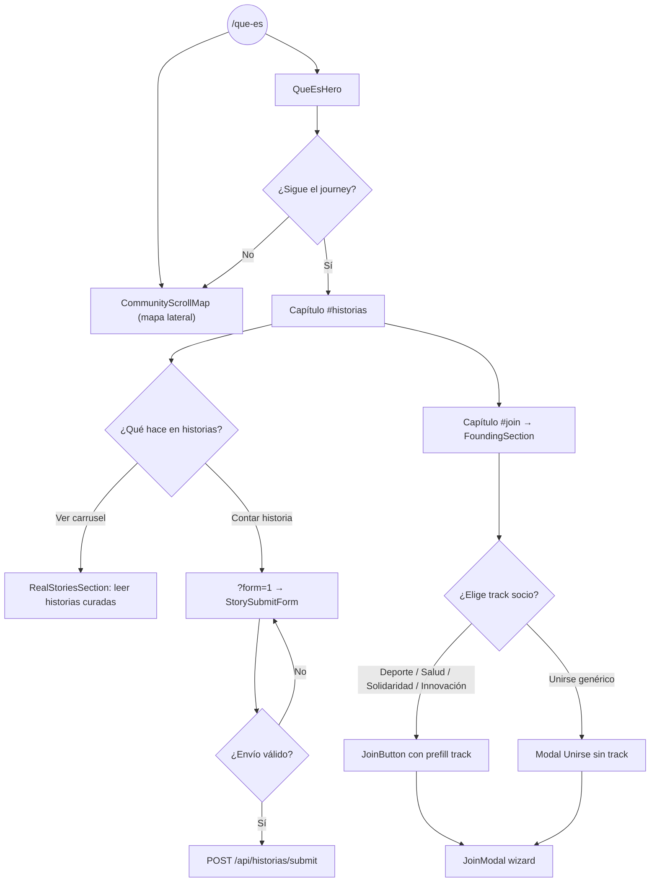
```mermaid
flowchart TD
  Start((/que-es)) --> Map["CommunityScrollMap (mapa lateral)"]
  Start --> Hero["QueEsHero"]
  Hero --> Chap{¿Sigue el journey?}
  Chap -->|Sí| Hist["Capítulo #historias"]
  Chap -->|No| Map
  Hist --> Stories{¿Qué hace en historias?}
  Stories -->|Ver carrusel| Read["RealStoriesSection: leer historias curadas"]
  Stories -->|Contar historia| Form["?form=1 → StorySubmitForm"]
  Form --> API{"¿Envío válido?"}
  API -->|Sí| OK["POST /api/historias/submit"]
  API -->|No| Form
  Hist --> Found["Capítulo #join → FoundingSection"]
  Found --> Track{¿Elige track socio?}
  Track -->|Deporte / Salud / Solidaridad / Innovación| JoinT["JoinButton con prefill track"]
  Track -->|Unirse genérico| JoinG["Modal Unirse sin track"]
  JoinT --> Modal["JoinModal wizard"]
  JoinG --> Modal
```

### `/historias` y `/informacion`

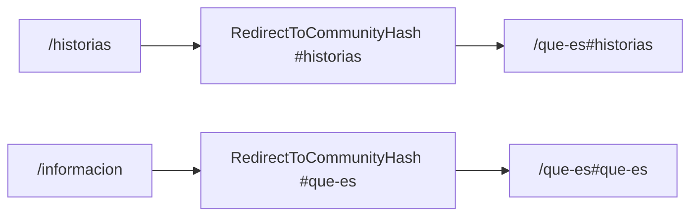
```mermaid
flowchart LR
  H["/historias"] --> R1["RedirectToCommunityHash #historias"]
  I["/informacion"] --> R2["RedirectToCommunityHash #que-es"]
  R1 --> Q["/que-es#historias"]
  R2 --> Q2["/que-es#que-es"]
```

---

## Verticales del ecosistema

### Patrón compartido (11 verticales)

Aplica a: `/deporte`, `/salud`, `/bienestar`, `/comunicacion`, `/solidaridad`, `/turismo`, `/comercios`, `/educacion`, `/eventos`, `/descubrimiento`, `/innovacion`.

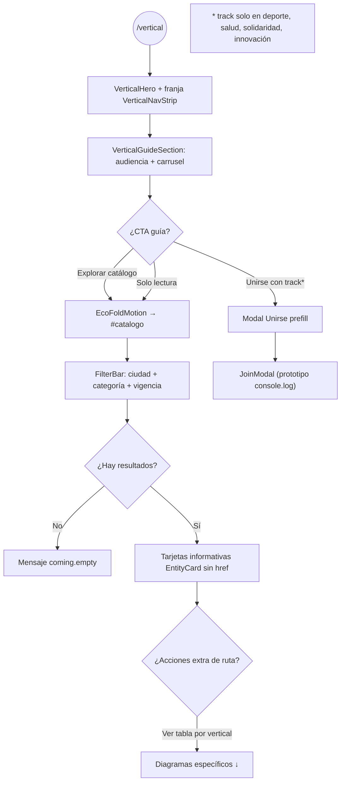
```mermaid
flowchart TD
  Start((/vertical)) --> Hero["VerticalHero + franja VerticalNavStrip"]
  Hero --> Guide["VerticalGuideSection: audiencia + carrusel"]
  Guide --> G1{¿CTA guía?}
  G1 -->|Explorar catálogo| Fold["EcoFoldMotion → #catalogo"]
  G1 -->|Unirse con track*| Join["Modal Unirse prefill"]
  G1 -->|Solo lectura| Fold
  Fold --> Filt["FilterBar: ciudad + categoría + vigencia"]
  Filt --> Empty{¿Hay resultados?}
  Empty -->|No| Msg["Mensaje coming.empty"]
  Empty -->|Sí| Cards["Tarjetas informativas EntityCard sin href"]
  Cards --> Extra{¿Acciones extra de ruta?}
  Extra -->|Ver tabla por vertical| Below["Diagramas específicos ↓"]
  Join --> Modal["JoinModal (prototipo console.log)"]

  note1["* track solo en deporte, salud, solidaridad, innovación"]
```

---

### `/deporte` (comunidad · track `sport`)

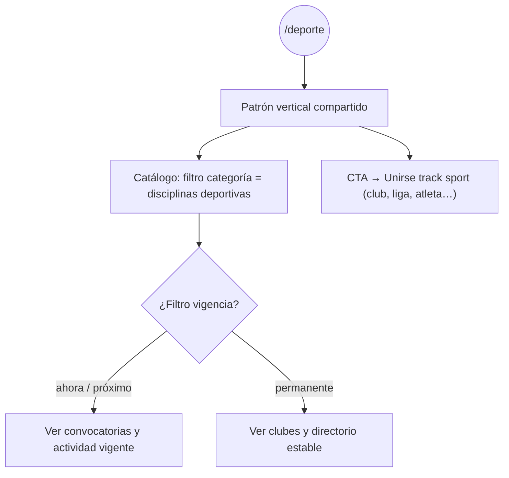
```mermaid
flowchart TD
  Start((/deporte)) --> Shared["Patrón vertical compartido"]
  Shared --> Cat["Catálogo: filtro categoría = disciplinas deportivas"]
  Cat --> Vig{¿Filtro vigencia?}
  Vig -->|ahora / próximo| Live["Ver convocatorias y actividad vigente"]
  Vig -->|permanente| Dir["Ver clubes y directorio estable"]
  Shared --> Join["CTA → Unirse track sport (club, liga, atleta…)"]
```

---

### `/salud` (comunidad · informational · track `health`)

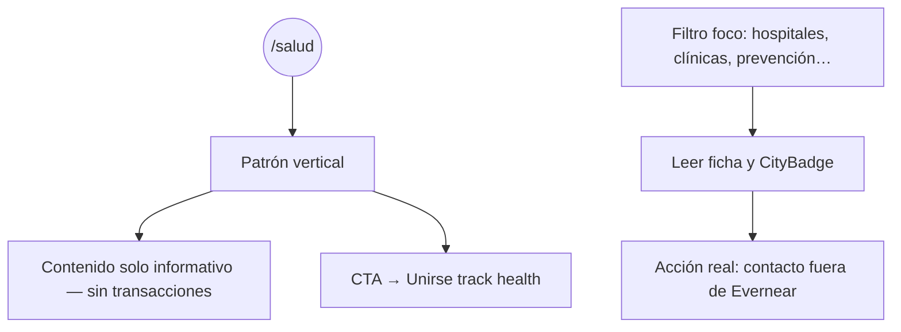
```mermaid
flowchart TD
  Start((/salud)) --> Shared["Patrón vertical"]
  Shared --> Info["Contenido solo informativo — sin transacciones"]
  Cat["Filtro foco: hospitales, clínicas, prevención…"] --> Read["Leer ficha y CityBadge"]
  Shared --> Join["CTA → Unirse track health"]
  Read --> Ext["Acción real: contacto fuera de Evernear"]
```

---

### `/bienestar` (comunidad · informational)

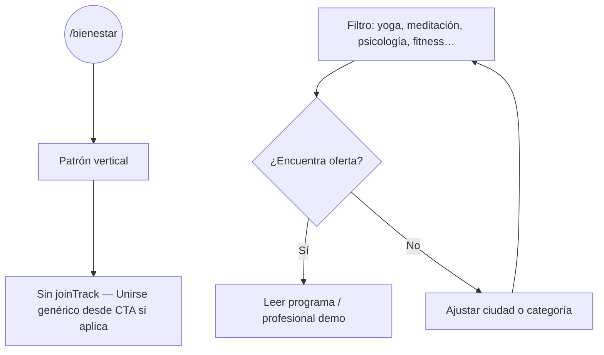
```mermaid
flowchart TD
  Start((/bienestar)) --> Shared["Patrón vertical"]
  Cat["Filtro: yoga, meditación, psicología, fitness…"] --> Pick{¿Encuentra oferta?}
  Pick -->|Sí| Read["Leer programa / profesional demo"]
  Pick -->|No| Adj["Ajustar ciudad o categoría"]
  Adj --> Cat
  Shared --> NoTrack["Sin joinTrack — Unirse genérico desde CTA si aplica"]
```

---

### `/comunicacion` (comunidad)

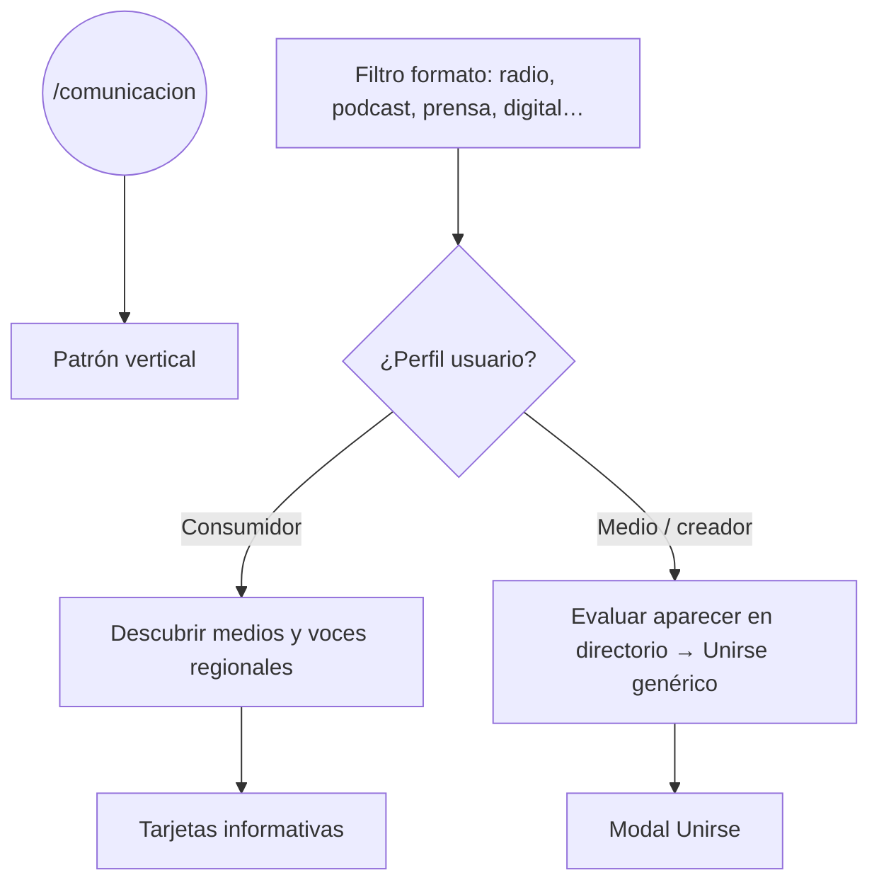
```mermaid
flowchart TD
  Start((/comunicacion)) --> Shared["Patrón vertical"]
  Cat["Filtro formato: radio, podcast, prensa, digital…"] --> Role{¿Perfil usuario?}
  Role -->|Consumidor| Consume["Descubrir medios y voces regionales"]
  Role -->|Medio / creador| Org["Evaluar aparecer en directorio → Unirse genérico"]
  Consume --> Cards["Tarjetas informativas"]
  Org --> Join["Modal Unirse"]
```

---

### `/solidaridad` (comunidad · informational · featured · track `solidarity`)

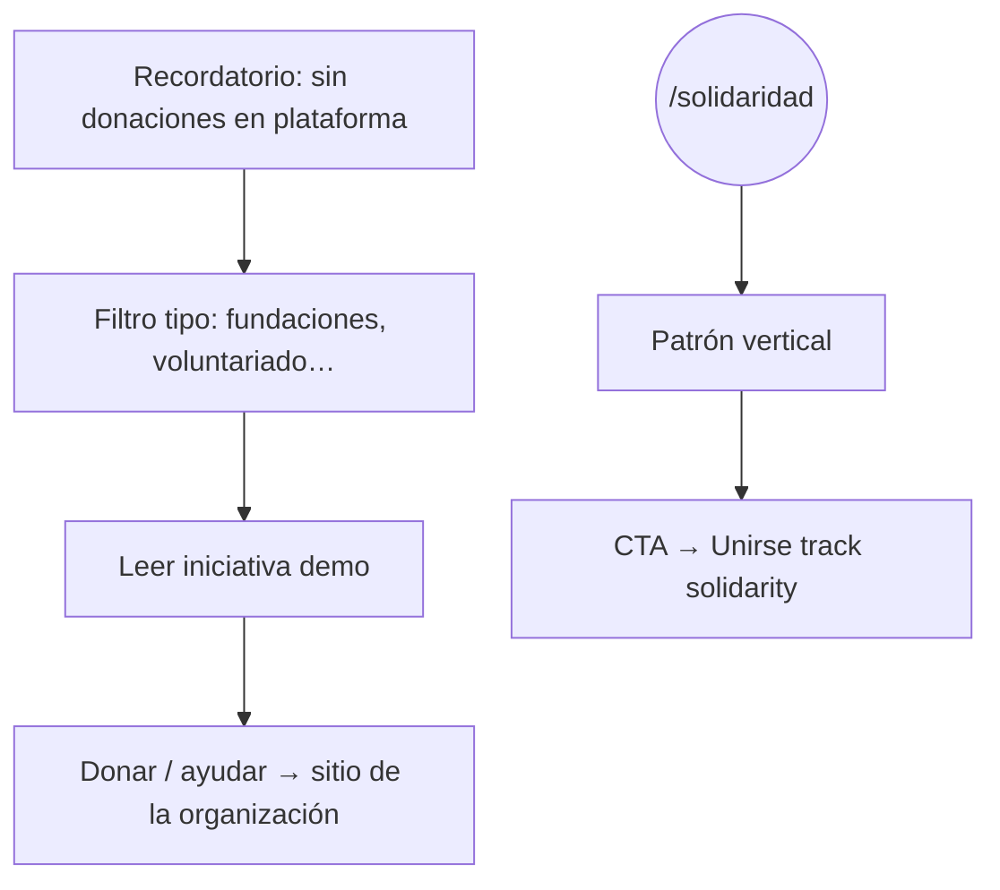
```mermaid
flowchart TD
  Start((/solidaridad)) --> Shared["Patrón vertical"]
  Info["Recordatorio: sin donaciones en plataforma"] --> Cat["Filtro tipo: fundaciones, voluntariado…"]
  Cat --> Read["Leer iniciativa demo"]
  Read --> Off["Donar / ayudar → sitio de la organización"]
  Shared --> Join["CTA → Unirse track solidarity"]
```

---

### `/turismo` (región)

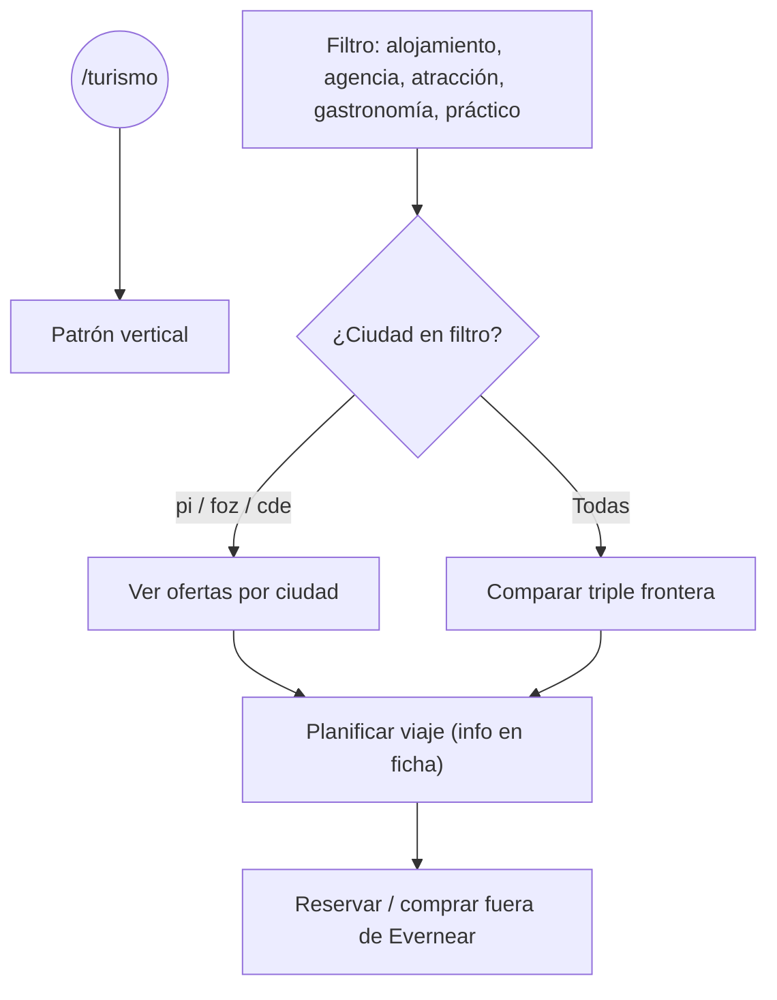
```mermaid
flowchart TD
  Start((/turismo)) --> Shared["Patrón vertical"]
  Cat["Filtro: alojamiento, agencia, atracción, gastronomía, práctico"] --> City{¿Ciudad en filtro?}
  City -->|pi / foz / cde| Local["Ver ofertas por ciudad"]
  City -->|Todas| Regional["Comparar triple frontera"]
  Local --> Plan["Planificar viaje (info en ficha)"]
  Regional --> Plan
  Plan --> Ext["Reservar / comprar fuera de Evernear"]
```

---

### `/comercios` (región)

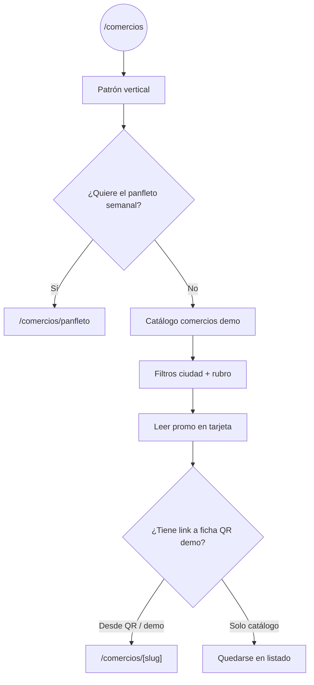
```mermaid
flowchart TD
  Start((/comercios)) --> Shared["Patrón vertical"]
  Shared --> Pan{¿Quiere el panfleto semanal?}
  Pan -->|Sí| PF["/comercios/panfleto"]
  Pan -->|No| Cat["Catálogo comercios demo"]
  Cat --> Filt["Filtros ciudad + rubro"]
  Filt --> Read["Leer promo en tarjeta"]
  Read --> QR{¿Tiene link a ficha QR demo?}
  QR -->|Desde QR / demo| Det["/comercios/[slug]"]
  QR -->|Solo catálogo| Stay["Quedarse en listado"]
```

---

### `/educacion` (región)

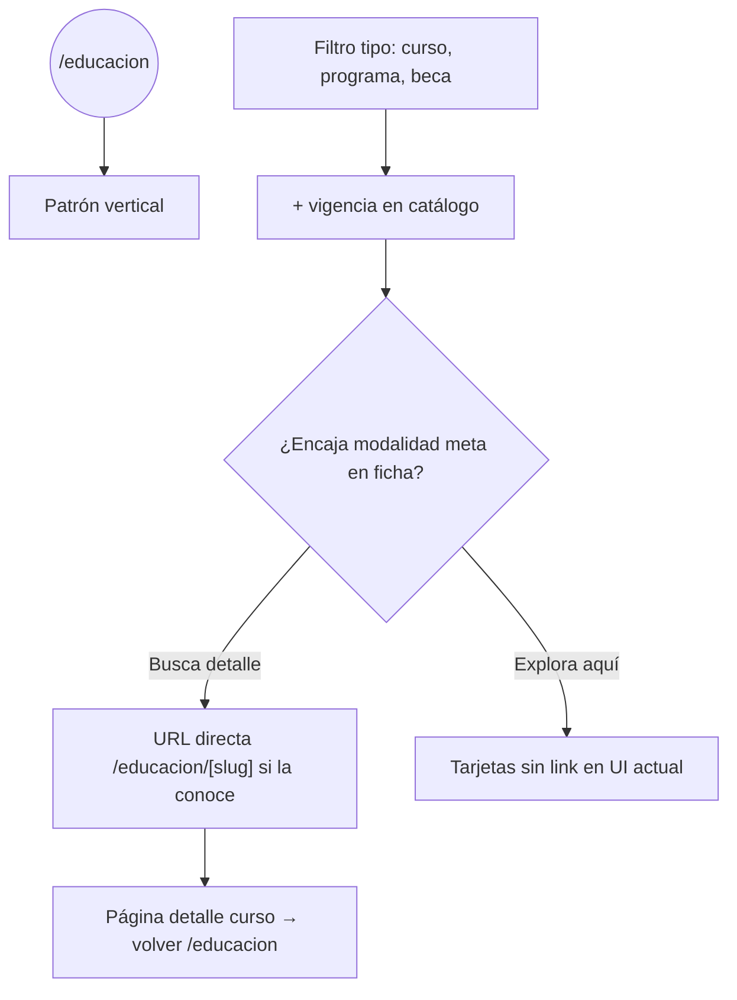
```mermaid
flowchart TD
  Start((/educacion)) --> Shared["Patrón vertical"]
  Cat["Filtro tipo: curso, programa, beca"] --> Mod["+ vigencia en catálogo"]
  Mod --> Match{¿Encaja modalidad meta en ficha?}
  Match -->|Busca detalle| URL["URL directa /educacion/[slug] si la conoce"]
  Match -->|Explora aquí| Cards["Tarjetas sin link en UI actual"]
  URL --> Det["Página detalle curso → volver /educacion"]
```

---

### `/eventos` (región)

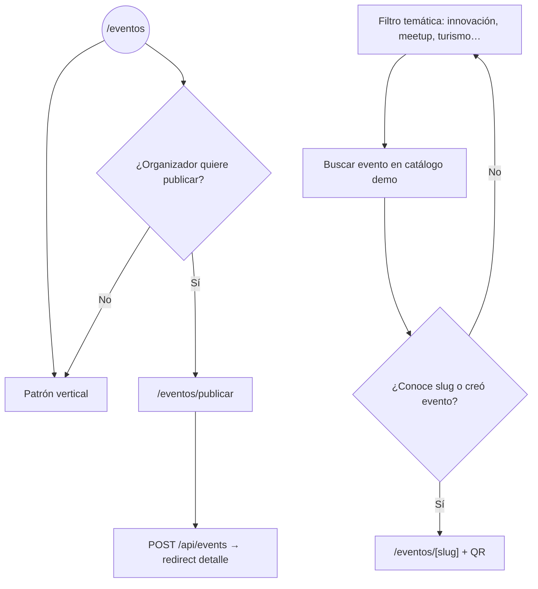
```mermaid
flowchart TD
  Start((/eventos)) --> Shared["Patrón vertical"]
  Cat["Filtro temática: innovación, meetup, turismo…"] --> Find["Buscar evento en catálogo demo"]
  Start --> Pub{¿Organizador quiere publicar?}
  Pub -->|Sí| PForm["/eventos/publicar"]
  Pub -->|No| Shared
  Find --> Slug{¿Conoce slug o creó evento?}
  Slug -->|Sí| Det["/eventos/[slug] + QR"]
  Slug -->|No| Cat
  PForm --> API["POST /api/events → redirect detalle"]
```

---

### `/descubrimiento` (región)

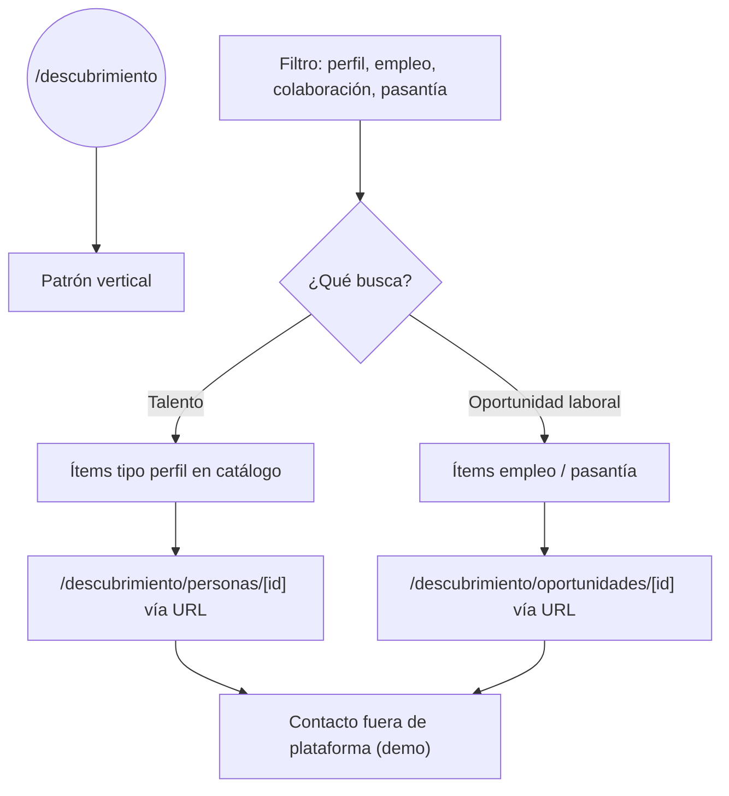
```mermaid
flowchart TD
  Start((/descubrimiento)) --> Shared["Patrón vertical"]
  Cat["Filtro: perfil, empleo, colaboración, pasantía"] --> Intent{¿Qué busca?}
  Intent -->|Talento| People["Ítems tipo perfil en catálogo"]
  Intent -->|Oportunidad laboral| Jobs["Ítems empleo / pasantía"]
  People --> URL1["/descubrimiento/personas/[id] vía URL"]
  Jobs --> URL2["/descubrimiento/oportunidades/[id] vía URL"]
  URL1 --> Contact["Contacto fuera de plataforma (demo)"]
  URL2 --> Contact
```

---

### `/innovacion` (región · track `innovation`)

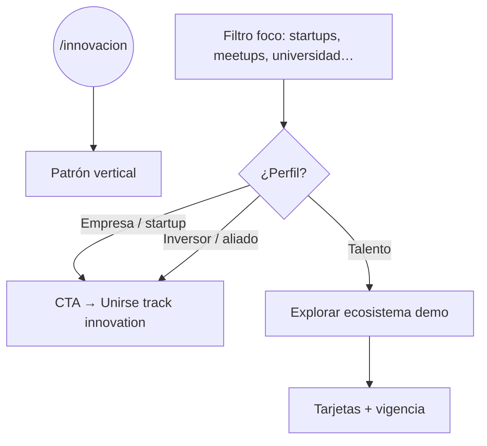
```mermaid
flowchart TD
  Start((/innovacion)) --> Shared["Patrón vertical"]
  Cat["Filtro foco: startups, meetups, universidad…"] --> Role{¿Perfil?}
  Role -->|Empresa / startup| Join["CTA → Unirse track innovation"]
  Role -->|Talento| Browse["Explorar ecosistema demo"]
  Role -->|Inversor / aliado| Join
  Browse --> Cards["Tarjetas + vigencia"]
```

---

## `/comercios/panfleto`

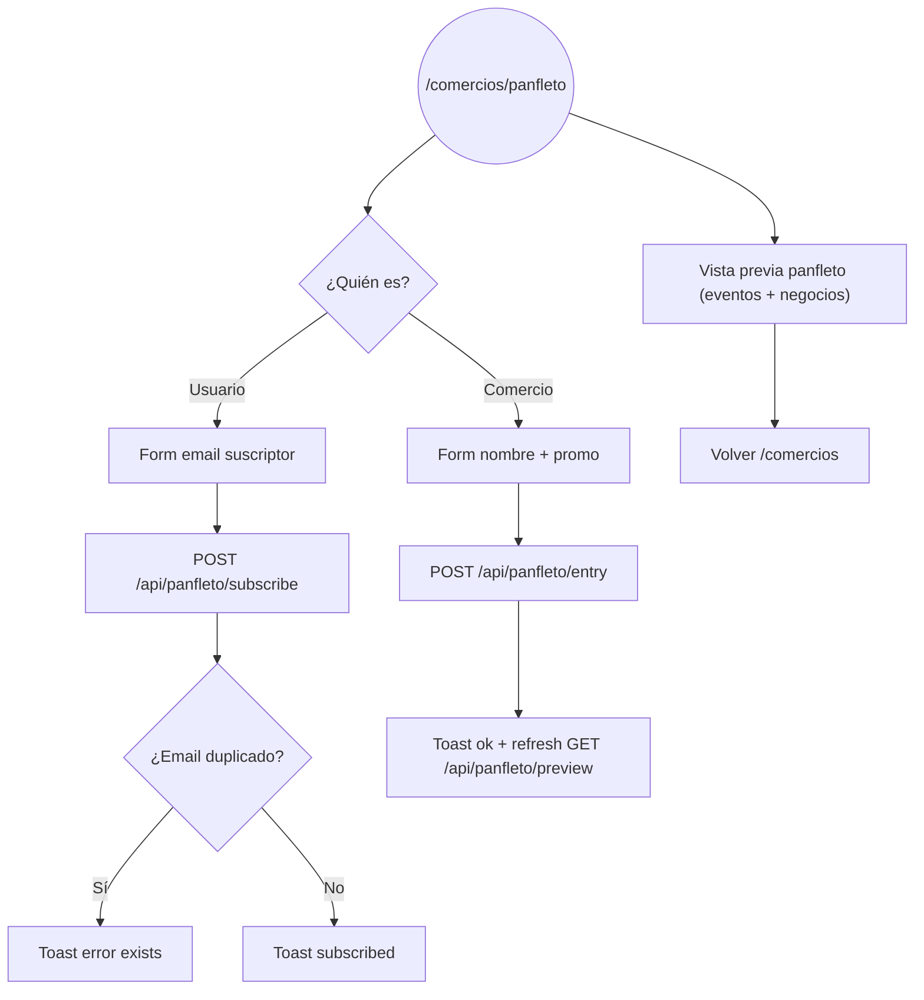
```mermaid
flowchart TD
  Start((/comercios/panfleto)) --> Role{¿Quién es?}
  Role -->|Usuario| U["Form email suscriptor"]
  Role -->|Comercio| B["Form nombre + promo"]
  U --> Sub["POST /api/panfleto/subscribe"]
  Sub --> Dup{¿Email duplicado?}
  Dup -->|Sí| ErrU["Toast error exists"]
  Dup -->|No| OkU["Toast subscribed"]
  B --> Ent["POST /api/panfleto/entry"]
  Ent --> OkB["Toast ok + refresh GET /api/panfleto/preview"]
  Start --> Prev["Vista previa panfleto (eventos + negocios)"]
  Prev --> Back["Volver /comercios"]
```

---

## `/comercios/[slug]`

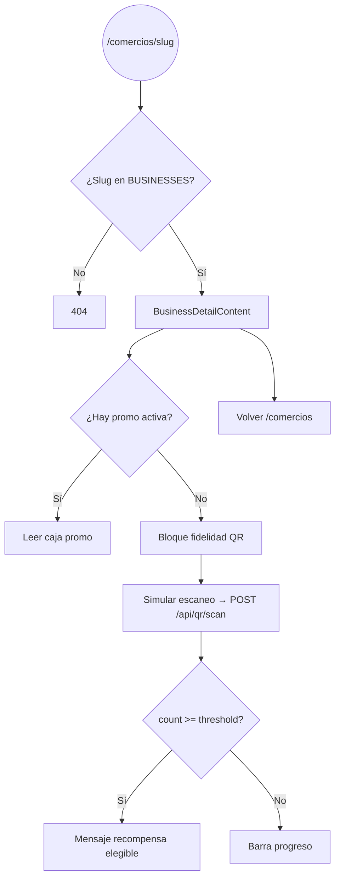
```mermaid
flowchart TD
  Start((/comercios/slug)) --> Found{¿Slug en BUSINESSES?}
  Found -->|No| NF["404"]
  Found -->|Sí| Det["BusinessDetailContent"]
  Det --> Promo{¿Hay promo activa?}
  Promo -->|Sí| ReadP["Leer caja promo"]
  Promo -->|No| Loyalty["Bloque fidelidad QR"]
  Loyalty --> Sim["Simular escaneo → POST /api/qr/scan"]
  Sim --> Reward{count >= threshold?}
  Reward -->|Sí| Win["Mensaje recompensa elegible"]
  Reward -->|No| Bar["Barra progreso"]
  Det --> Back["Volver /comercios"]
```

---

## `/eventos/publicar`

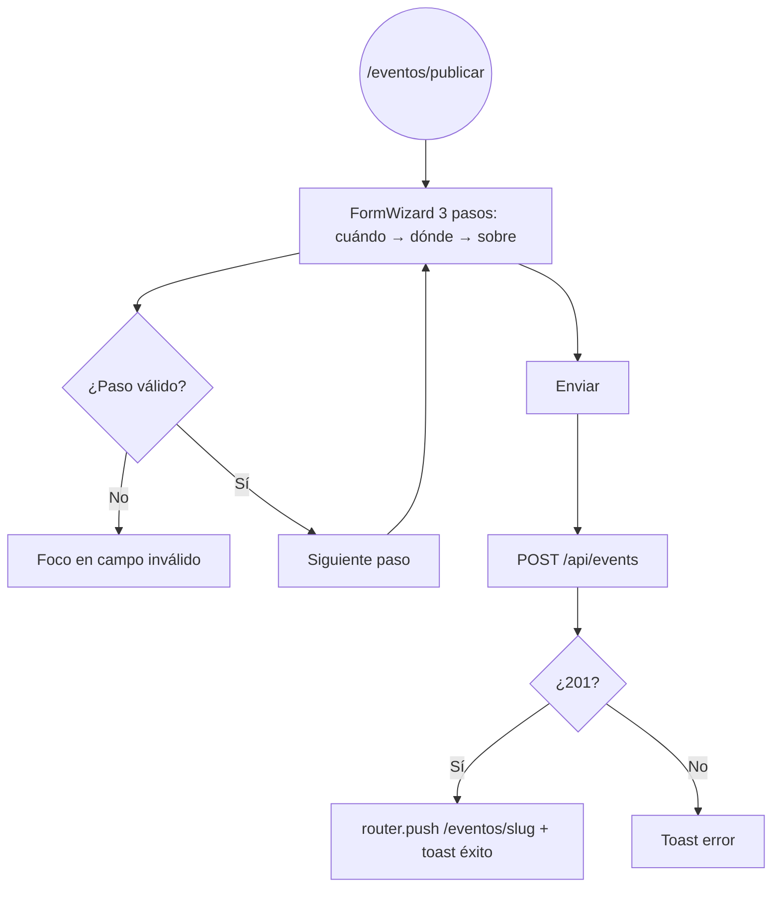
```mermaid
flowchart TD
  Start((/eventos/publicar)) --> W["FormWizard 3 pasos: cuándo → dónde → sobre"]
  W --> Step{¿Paso válido?}
  Step -->|No| Fix["Foco en campo inválido"]
  Step -->|Sí| Next["Siguiente paso"]
  Next --> W
  W --> Submit["Enviar"]
  Submit --> API["POST /api/events"]
  API --> OK{¿201?}
  OK -->|Sí| Go["router.push /eventos/slug + toast éxito"]
  OK -->|No| Err["Toast error"]
```

---

## `/eventos/[slug]`

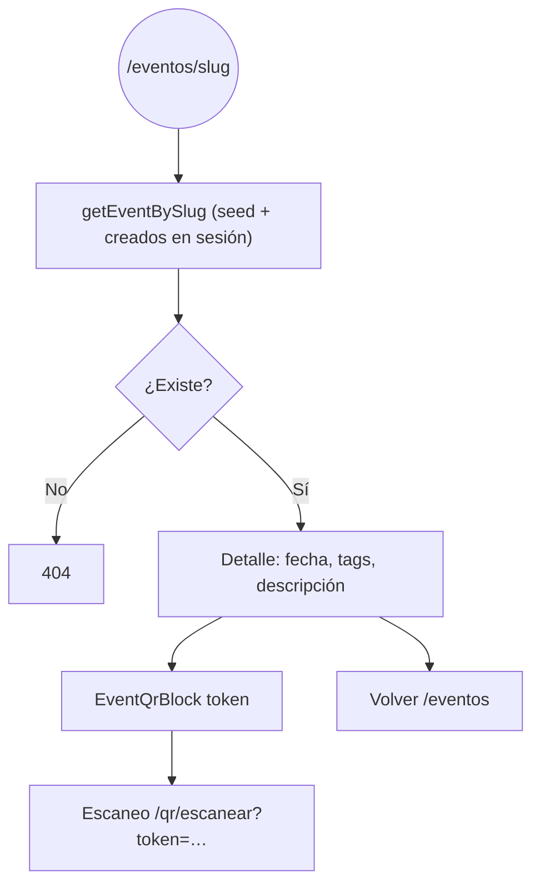
```mermaid
flowchart TD
  Start((/eventos/slug)) --> Load["getEventBySlug (seed + creados en sesión)"]
  Load --> Found{¿Existe?}
  Found -->|No| NF["404"]
  Found -->|Sí| Read["Detalle: fecha, tags, descripción"]
  Read --> QR["EventQrBlock token"]
  QR --> Scan["Escaneo /qr/escanear?token=…"]
  Read --> Back["Volver /eventos"]
```

---

## `/educacion/[slug]`

```mermaid
flowchart TD
  Start((/educacion/slug)) --> Found{¿En COURSES?}
  Found -->|No| NF["404"]
  Found -->|Sí| Read["Tipo, institución, modalidad, país"]
  Read --> Apply{¿Quiere inscribirse?}
  Apply -->|Sí| Ext["Proceso en institución (fuera de Evernear)"]
  Apply -->|No| Back["Volver /educacion"]
```

---

## Descubrimiento detalle

### `/descubrimiento/personas/[id]`

```mermaid
flowchart TD
  Start((personas/id)) --> Found{¿En PROFILES?}
  Found -->|No| NF["404"]
  Found -->|Sí| Read["Foto, rol, quote, skills"]
  Read --> Connect{¿Contactar?}
  Connect -->|Sí| Off["Fuera de plataforma (demo)"]
  Connect -->|No| Back["/descubrimiento"]
```

### `/descubrimiento/oportunidades/[id]`

```mermaid
flowchart TD
  Start((oportunidades/id)) --> Found{¿En OPPORTUNITIES?}
  Found -->|No| NF["404"]
  Found -->|Sí| Read["Empresa, tipo, modalidad"]
  Read --> Apply{¿Postularse?}
  Apply -->|Sí| Off["Canal del empleador (demo)"]
  Apply -->|No| Back["/descubrimiento"]
```

---

## `/pulso`

```mermaid
flowchart TD
  Start((/pulso)) --> Hero["PulsoHero: próxima emisión"]
  Hero --> Stream{¿Hay live / replay?}
  Stream -->|Sí| Player["PulsoStreamPlayer"]
  Stream -->|No| Ticker["PulsoTicker igualmente"]
  Player --> Seg["Clic segmento escaleta"]
  Seg --> Spotlight["PulsoSpotlight tema central"]
  Start --> Radar["PulsoCityRadar: ciudad, vertical, semana"]
  Radar --> QS["Actualiza query ?city & vertical & week"]
  QS --> Preview["GET /api/pulso/preview"]
  Preview --> VOD["PulsoVods: otra semana"]
  Start --> Pass["PulsoPassport"]
  Pass --> Sub["POST /api/pulso/subscribe"]
  Sub --> LiveOpt{¿notifyLive?}
  LiveOpt -->|Sí| Alert["Marca alerta vivo"]
  LiveOpt -->|No| Email["Solo newsletter demo"]
```

---

## `/qr/escanear`

```mermaid
flowchart TD
  Start((/qr/escanear)) --> Token{¿Query token?}
  Token -->|No| Demo["Lista demos → ?token=…"]
  Demo --> Start
  Token -->|Sí| Post["POST /api/qr/scan auto"]
  Post --> Show["Muestra count, threshold, rewardEligible"]
  Show --> Link{¿Token de demo?}
  Link -->|evento| Ev["/eventos/…"]
  Link -->|comercio| Biz["/comercios/…"]
  Link -->|Otro| Stay["Solo feedback escaneo"]
```

---

## Legal

### `/terminos` y `/privacidad`

```mermaid
flowchart TD
  Start((/terminos o /privacidad)) --> Read["LegalPage: título + párrafos i18n"]
  Read --> Next{¿Siguiente paso?}
  Next -->|Volver al sitio| Nav["Header / footer"]
  Next -->|Dudas datos| Priv["/privacidad si estaba en términos"]
  Read --> End((Fin lectura))
```

---

## Transversal: Unirse y mascota

### Modal Unirse (cualquier ruta con `SiteShell`)

```mermaid
flowchart TD
  Open["Abrir modal"] --> Mode{¿prefill.track?}
  Mode -->|No| Person["Wizard persona: you → profile → more"]
  Mode -->|Sí| Org["Wizard org: org → you → collab → more"]
  Person --> Valid["Validar email, país, ciudad, rol"]
  Org --> ValidO["+ org_name, org_type, city_zone, collaboration"]
  Valid --> Send["Enviar"]
  ValidO --> Send
  Send --> OK{¿Campos OK?}
  OK -->|No| Retry["Toast + paso con error"]
  OK -->|Sí| Success["Vista éxito — payload solo console.log"]
```

### Mascota Evernear (`EvernearGuideLayer`)

```mermaid
flowchart TD
  Dock["Icono flotante"] --> Mode{¿Modo?}
  Mode -->|idle/menu| Menu["Tour o Chat"]
  Mode -->|tour| Steps["OnboardJS: pasos por sección de página"]
  Mode -->|chat| Chat["EvernearChatPanel → /api/chat"]
  Steps --> Anchor["Scroll a #hero, #border, guía vertical…"]
  Chat --> Lang["Usa lang + pathname en prompt"]
  Dock --> Drag["Arrastrar → guardar posición localStorage"]
```

---

## Matriz: ruta → decisión principal → salida

| Ruta | Decisión principal del usuario | Salida típica |
|------|-------------------------------|---------------|
| `/` | ¿Exploro región o me uno? | Vertical o `#join` |
| `/ecosistema` | ¿Comunidad o región? | `/vertical` |
| `/que-es` | ¿Leo, cuento historia o me uno? | Form historias / modal |
| `/deporte` | ¿Qué disciplina y vigencia? | Ficha demo / Unirse sport |
| `/salud` | ¿Qué foco de salud? | Info + Unirse health |
| `/bienestar` | ¿Qué práctica busco? | Ficha demo |
| `/comunicacion` | ¿Consumo o soy medio? | Catálogo / Unirse |
| `/solidaridad` | ¿Qué causa explorar? | Organizador externo / Unirse |
| `/turismo` | ¿Qué ciudad y rubro? | Planificación externa |
| `/comercios` | ¿Catálogo o panfleto? | `/panfleto` o ficha QR |
| `/educacion` | ¿Curso, programa o beca? | Detalle por URL |
| `/eventos` | ¿Busco o publico? | Catálogo / `/publicar` |
| `/descubrimiento` | ¿Talento u oportunidad? | Detalle por URL |
| `/innovacion` | ¿Exploro o sumo startup? | Unirse innovation |
| `/pulso` | ¿Vivo, archivo o suscripción? | Stream / VOD / subscribe |
| `/qr/escanear` | ¿Token válido? | Contador + enlace demo |

---

Ver también: [Flujos de usuario](./flujos-usuario.md) · [Rutas y páginas](./rutas-paginas.md)
